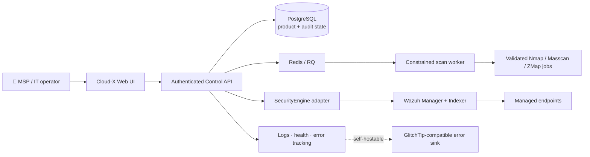
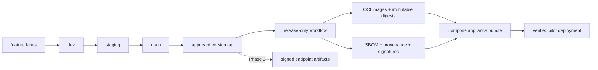
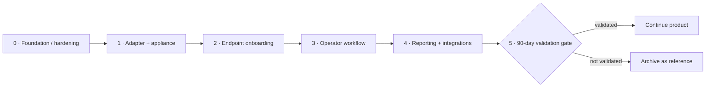
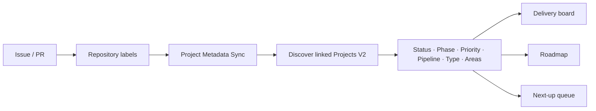
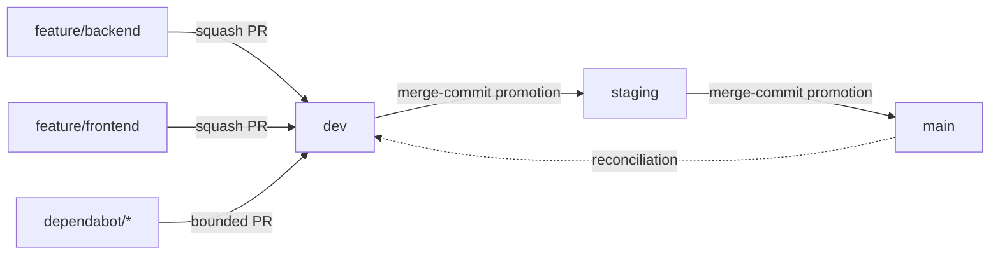

<div align="center">

# 🛡️ Cloud-X Security

### Self-hosted security operations for SMBs & MSPs

**Deploy confidently · Triage faster · Remediate safely · Prove what happened**

[](https://github.com/MAPLEIZER/Cloud-X-MVP/actions/workflows/docker-build.yml)
[](https://github.com/MAPLEIZER/Cloud-X-MVP/actions/workflows/dependency-security.yml)
[](https://github.com/MAPLEIZER/Cloud-X-MVP/actions/workflows/branch-enforcement.yml)
[](https://github.com/MAPLEIZER/Cloud-X-MVP/actions/workflows/branch-policy.yml)
[](https://github.com/MAPLEIZER/Cloud-X-MVP/actions/workflows/project-sync.yml)

[](LICENSE)
[](#-delivery-status)
[](https://wazuh.com/)
[](docs/PACKAGING_STRATEGY.md)

[**Architecture**](docs/ARCHITECTURE.md) · [**Roadmap**](docs/ROADMAP.md) · [**Packaging**](docs/PACKAGING_STRATEGY.md) · [**Security**](SECURITY.md) · [**Issues**](https://github.com/MAPLEIZER/Cloud-X-MVP/issues) · [**Research**](docs/research/2026-08-14-smb-msp-soc-product-decision.md)

</div>

---

> [!WARNING]
> **Cloud-X is in product validation / pre-production.** The repository has production-oriented security controls and release design, but development builds are not yet a supported primary production security control.

Cloud-X is an opinionated **security operations control plane** built around **Wazuh as the initial security engine**. It does not try to rebuild SIEM/EDR primitives. It focuses on the operational layer that small IT teams and MSPs otherwise have to assemble themselves: trusted deployment, endpoint onboarding, health, finding normalization, bounded remediation, evidence, reporting, upgrades and supportability.

<table>
<tr>
<td width="25%" valign="top">

### ⚙️ Control plane
**React + Flask**

Authenticated UI/API with a Wazuh-backed `SecurityEngine` abstraction.

</td>
<td width="25%" valign="top">

### 🧰 Durable runtime
**PostgreSQL + Redis/RQ**

Alembic migrations and restart-safe queued scanner execution.

</td>
<td width="25%" valign="top">

### 🔭 Observable
**JSON logs + health + GlitchTip**

Self-hostable centralized error tracking with privacy-first scrubbing.

</td>
<td width="25%" valign="top">

### 🔐 Governed
**Security + branch gates**

Dependency auditing, five permanent lanes and label-driven planning metadata.

</td>
</tr>
</table>

## 🎯 What Cloud-X is trying to make easier

<table>
<tr>
<td width="33%" valign="top">

### 🚀 Deploy

Turn an open security stack into a repeatable appliance with compatibility checks, immutable release artifacts, health verification and upgrade/rollback paths.

</td>
<td width="33%" valign="top">

### 🎯 Decide

Turn raw security-engine output into a smaller operator-facing finding set with context, ownership and safe next actions.

</td>
<td width="33%" valign="top">

### 📋 Prove

Produce auditable activity, posture evidence and customer-ready reports without forcing ordinary users into security-engine internals.

</td>
</tr>
</table>

> **Product boundary:** Cloud-X should reduce the work around Wazuh—not become another generic SIEM dashboard, proprietary EDR agent, unrestricted remote shell or collection of integrations with no operator workflow.

## 🧭 System view



The customer-facing product is intentionally separated from Wazuh-specific implementation details. The adapter boundary lets Cloud-X normalize security-engine capabilities without binding every UI workflow to one provider forever.

**Architecture rules:** [`docs/ARCHITECTURE.md`](docs/ARCHITECTURE.md) · **Security policy:** [`SECURITY.md`](SECURITY.md)

## 📊 Delivery status

Legend: **✅ implemented** · **🟡 implementation exists; acceptance/integration remains** · **🛠 active backlog** · **🧭 defined next**

| Product surface | State | Evidence / next gate |
|---|:---:|---|
| Authenticated control API | ✅ | Server-side authorization; Clerk session JWTs verified networklessly against the configured public key |
| PostgreSQL + Alembic | ✅ | Clean/idempotent migrations exercised in Docker CI |
| Durable scanner queue | ✅ | Redis/RQ jobs survive API-process boundaries; lifecycle tested in CI |
| Non-root backend runtime | ✅ | Container UID/GID and scanner smoke checks are CI-gated |
| Structured observability | ✅ | JSON request logs, liveness/readiness, Flask/RQ/frontend error capture |
| Self-hosted error tracking | ✅ | GlitchTip-compatible backend integration; PII/request-body collection disabled |
| Dependency security gate | ✅ | Node high/critical audit + Python OSV audit on permanent branches/PRs |
| Wazuh `SecurityEngine` connector | 🟡 | Connector/dashboard code exists; **live Manager + Indexer acceptance remains in [#24](https://github.com/MAPLEIZER/Cloud-X-MVP/issues/24)** |
| Production appliance release | 🛠 | HTTPS, release-only OCI publishing, signed evidence and bundle work in [#28](https://github.com/MAPLEIZER/Cloud-X-MVP/issues/28) |
| Posture/reporting MVP | 🛠 | Real-data report output remains in [#29](https://github.com/MAPLEIZER/Cloud-X-MVP/issues/29) |
| Cross-platform endpoint enrollment | 🧭 | Shared contract + Windows/Linux/macOS gates defined in [#93–#97](https://github.com/MAPLEIZER/Cloud-X-MVP/issues/93) |
| MSP customer/site workflow | 🧭 | Phase 3 after reliable endpoint onboarding |

> [!NOTE]
> The Python security gate currently contains **one exact, time-bounded upstream-blocked exception** for `PYSEC-2026-3552`, tracked in [#99](https://github.com/MAPLEIZER/Cloud-X-MVP/issues/99). All other discovered Python vulnerabilities remain blocking.

## 🧩 Product ownership boundary

| Cloud-X owns | Security engine owns |
|---|---|
| Guided self-hosted/private-cloud deployment | Endpoint telemetry and agent protocol |
| Customer/site/operator workflows | FIM, SCA, inventory and vulnerability primitives |
| Signed enrollment/bootstrap release artifacts | Low-level detection/event processing |
| Opinionated policy and finding normalization | Raw alert/event storage |
| Typed, auditable remediation workflows | Existing response primitives |
| Notifications / ticket / RMM integrations | Engine-native configuration details |
| Evidence, reporting and support state | Commodity SIEM mechanics |
| Upgrade/rollback orchestration | — |

## 🔄 North-star operator flow

```mermaid
flowchart LR
    A["Deploy Cloud-X"] --> B["Connect security engine"]
    B --> C["Create customer / site"]
    C --> D["Generate trusted enrollment artifact"]
    D --> E["Deploy through RMM / MDM / GPO"]
    E --> F["Verify endpoint health"]
    F --> G["Normalize findings"]
    G --> H["Review / approve bounded response"]
    H --> I["Generate evidence / report"]
```



The success metric is **less operator work and clearer outcomes**, not a larger dashboard.

## 📦 Release & packaging model

Cloud-X needs packages where operators actually deploy product boundaries—not public packages for application internals.

<table>
<tr>
<td width="33%" valign="top">

### 🐳 Control plane OCI
**Phase 1 release surface**

- `cloudx-frontend`
- `cloudx-backend`
- scan worker reuses the backend digest
- GHCR first; registry-portable

</td>
<td width="33%" valign="top">

### 📦 Appliance bundle
**Phase 1 release surface**

Versioned Compose bundle with immutable image digests, compatibility metadata, checksums, SBOM/provenance, install/verify/upgrade/rollback tooling.

</td>
<td width="33%" valign="top">

### 💻 Endpoint enrollment
**Phase 2 release surface**

- Windows signed bootstrap; MSI if pilots justify it
- Linux signed bootstrap + verified DEB/RPM path
- macOS signed/notarized `.pkg`

</td>
</tr>
</table>



**Not planned before validation:** public npm/PyPI application packages, Helm/Kubernetes packaging merely for completeness, or a proprietary persistent Cloud-X endpoint daemon.

Read the full decision: [`docs/PACKAGING_STRATEGY.md`](docs/PACKAGING_STRATEGY.md).

## 🗺️ Roadmap pulse



| Phase | Current position | Key work |
|---|---|---|
| **0 · Foundation** | Security/repository baseline established | Continue provenance/release reproducibility and legacy consolidation |
| **1 · Pilot core** | **Active** | [#24](https://github.com/MAPLEIZER/Cloud-X-MVP/issues/24) live Wazuh acceptance · [#28](https://github.com/MAPLEIZER/Cloud-X-MVP/issues/28) production appliance · [#29](https://github.com/MAPLEIZER/Cloud-X-MVP/issues/29) reporting |
| **2 · Enrollment** | **Defined next** | [#93](https://github.com/MAPLEIZER/Cloud-X-MVP/issues/93) shared contract → [#94](https://github.com/MAPLEIZER/Cloud-X-MVP/issues/94) Windows / [#95](https://github.com/MAPLEIZER/Cloud-X-MVP/issues/95) Linux / [#96](https://github.com/MAPLEIZER/Cloud-X-MVP/issues/96) macOS → [#97](https://github.com/MAPLEIZER/Cloud-X-MVP/issues/97) acceptance gate |
| **3–4** | Post-onboarding | Opinionated MSP workflow, evidence and integrations |
| **5** | Validation gate | Real deployments, operational metrics and explicit go/archive decision |

### Pilot continuation gates

| Measure | Minimum target |
|---|---:|
| Serious design partners | ≥3 organizations; preferably ≥2 MSPs |
| Real endpoint coverage | ≥200 endpoints, or ≥3 real organizations for smaller fleets |
| Independent deployments | ≥2 without developer intervention |
| Setup time | p50 <30 min · p95 <60 min |
| Unattended endpoint enrollment | ≥95% first-attempt success |
| Cross-tenant negative tests | 100% pass |
| Supported release artifacts | 100% signed with SBOM/provenance |
| Unwaived exploitable Critical/High release vulnerabilities | 0 |

Full roadmap: [`docs/ROADMAP.md`](docs/ROADMAP.md).

## 🔐 Security model

<table>
<tr>
<td width="33%" valign="top">

### 🧱 Fail closed

- authenticated control API
- deployment target allow-lists
- Windows remote deployment disabled by default
- trusted origins for Clerk tokens

</td>
<td width="33%" valign="top">

### 🧪 Prove in CI

- frontend/backend image builds
- non-root runtime assertions
- scanner smoke test
- migrations + RQ lifecycle
- dependency vulnerability gates

</td>
<td width="33%" valign="top">

### 🔏 Release deliberately

- no mutable-branch supported installers
- no routine image publishing from `main`
- signed/verifiable release artifacts
- explicit security waiver tracking

</td>
</tr>
</table>

Hard rules include **no generic shell as a normal remediation surface**, **no unsigned mutable installer channel**, and **no claim of supported release with unwaived exploitable Critical/High vulnerabilities**.

See [`SECURITY.md`](SECURITY.md), [`docs/security/DEPENDENCY_WAIVERS.md`](docs/security/DEPENDENCY_WAIVERS.md), and [`THIRD_PARTY_NOTICES.md`](THIRD_PARTY_NOTICES.md).

## 🏷️ Issues → Projects automation

The repository labels are the planning source of truth:

`phase:*` · `status:*` · `priority:*` · `pipeline:*` · `type:*` · `area:*`



The sync is ID-free/config-driven: a newly linked Project can reuse the same metadata mapping without committing board/item IDs. Project writes activate when the repository Actions secret `PROJECTS_TOKEN` is configured; without it, the workflow **skips writes safely** and labels remain authoritative.

Operations guide: [`docs/operations/PROJECT_AUTOMATION.md`](docs/operations/PROJECT_AUTOMATION.md).

## 🌿 Enforced delivery workflow



Cloud-X intentionally keeps **five permanent branches** rather than creating a new same-repo topic branch for every task. Branch Policy and Branch Enforcement validate the allowed topology and routing.

<details>
<summary><strong>Branch responsibilities</strong></summary>

| Branch | Purpose |
|---|---|
| `feature/backend` | Reusable backend, infrastructure, security, CI and governance work lane |
| `feature/frontend` | Reusable frontend/presentation/documentation work lane |
| `dev` | Integration branch |
| `staging` | Promotion/release-candidate branch |
| `main` | Stable/default branch |
| `dependabot/*` | Temporary bounded automation branches only while an eligible PR exists |

See [`docs/operations/BRANCH_STRATEGY.md`](docs/operations/BRANCH_STRATEGY.md) and [`docs/operations/BRANCH_RUNBOOK.md`](docs/operations/BRANCH_RUNBOOK.md).

</details>

## 🧰 Technology map

| Layer | Current technology / responsibility |
|---|---|
| Web UI | React · TypeScript · Vite · Tailwind/shadcn-style component system |
| Authentication | Clerk frontend session + backend networkless RS256 JWT verification |
| Control API | Flask · Gunicorn · Python |
| Product database | PostgreSQL · SQLAlchemy · Alembic |
| Durable jobs | Redis · RQ |
| Security engine | `SecurityEngine` abstraction · Wazuh Manager/Indexer provider |
| Scanning | Nmap · Masscan · ZMap with validated targets/argument construction |
| Observability | Structured JSON logs · health/readiness · GlitchTip-compatible error tracking |
| Runtime | Hardened non-root Docker images · Compose-first deployment |
| CI/security | Docker regression suite · Node/Python dependency audits · branch governance |
| Planning automation | Label-driven GitHub Projects V2 metadata sync |

## 🧬 Repository family

| Repository | Role | Status |
|---|---|---|
| **Cloud-X-MVP** | Canonical Cloud-X product repository | **Active during validation** |
| [Cloud-X-security-agent](https://github.com/MAPLEIZER/Cloud-X-security-agent) | Historical Windows/Linux installer and Wazuh policy source material | Consolidation/provenance source |
| [Cloud-X-Dashboard](https://github.com/MAPLEIZER/Cloud-X-Dashboard) | Legacy dashboard/UI snapshot | Consolidation/provenance source; not canonical |

New product logic should not be independently reimplemented across the legacy repositories. See [`docs/REPOSITORY_MAP.md`](docs/REPOSITORY_MAP.md).

## 💻 Development

> Development commands below are **not** the supported production deployment contract. Supported distribution is moving toward immutable versioned release artifacts described in the packaging strategy.

<details>
<summary><strong>Frontend development</strong></summary>

```bash
pnpm install
pnpm dev
```

</details>

<details>
<summary><strong>Backend development</strong></summary>

```bash
cd cloudx-flask-backend
python -m venv .venv
# activate the virtual environment for your OS
pip install -r requirements.txt
```

Backend runtime configuration is documented in `.env.example` / `cloudx-flask-backend/.env.example`. Production authentication requires the Clerk instance JWT public key and trusted frontend parties.

</details>

<details>
<summary><strong>CI expectations</strong></summary>

A normal merge candidate is expected to pass:

- Branch Enforcement;
- Branch Policy + governance tests;
- Dependency Security;
- frontend Docker build;
- backend Docker build;
- reverse-proxy syntax validation;
- non-root runtime assertion;
- Nmap smoke test;
- PostgreSQL migrations;
- Redis/RQ durable job lifecycle;
- backend regression/security tests.

Normal CI **does not publish product images**.

</details>

## 📚 Documentation hub

| Document | Use it for |
|---|---|
| [`docs/ARCHITECTURE.md`](docs/ARCHITECTURE.md) | System boundaries and target architecture |
| [`docs/ROADMAP.md`](docs/ROADMAP.md) | Gated product-development sequence and validation criteria |
| [`docs/PACKAGING_STRATEGY.md`](docs/PACKAGING_STRATEGY.md) | OCI/appliance/endpoint distribution and release policy |
| [`docs/operations/ERROR_TRACKING.md`](docs/operations/ERROR_TRACKING.md) | Self-hosted GlitchTip-compatible observability operations |
| [`docs/operations/PROJECT_AUTOMATION.md`](docs/operations/PROJECT_AUTOMATION.md) | Label-driven GitHub Projects automation |
| [`docs/operations/BRANCH_STRATEGY.md`](docs/operations/BRANCH_STRATEGY.md) | Permanent branch architecture and promotion rules |
| [`docs/research/2026-08-14-smb-msp-soc-product-decision.md`](docs/research/2026-08-14-smb-msp-soc-product-decision.md) | Product/market/architecture research and go/no-go reasoning |
| [`THIRD_PARTY_NOTICES.md`](THIRD_PARTY_NOTICES.md) | Open-source provenance and release obligations |
| [`SECURITY.md`](SECURITY.md) | Security policy and vulnerability reporting |

## 📜 Licensing

Cloud-X-authored code is licensed under the [MIT License](LICENSE). Third-party software, adapted source and integrated components remain under their respective licenses; see [`THIRD_PARTY_NOTICES.md`](THIRD_PARTY_NOTICES.md).

---

<div align="center">

### Build less SIEM. Operate more security.

**Cloud-X succeeds only if real operators can deploy it, understand it and prove outcomes with less effort.**

[Roadmap](docs/ROADMAP.md) · [Packaging](docs/PACKAGING_STRATEGY.md) · [Architecture](docs/ARCHITECTURE.md) · [Issue tracker](https://github.com/MAPLEIZER/Cloud-X-MVP/issues)

</div>
