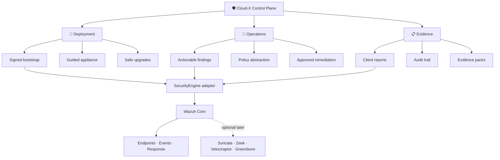
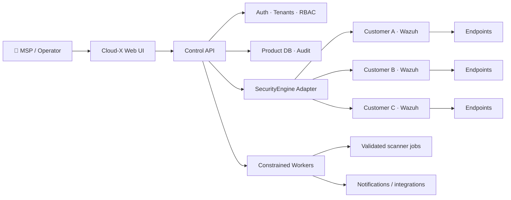
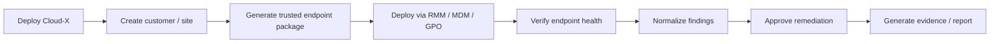
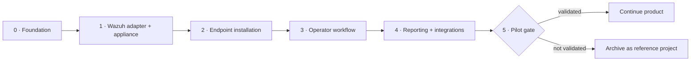
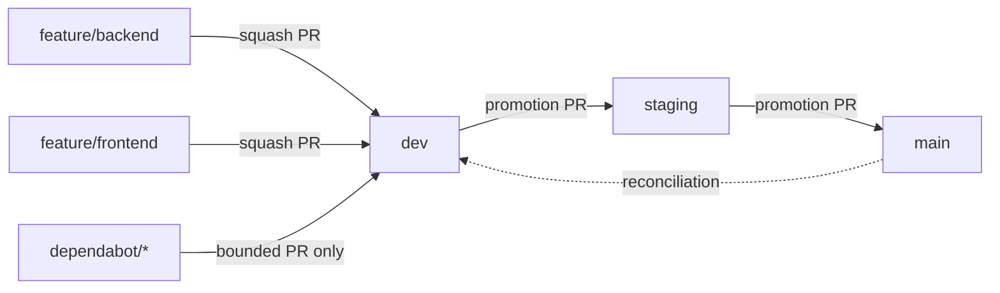

<div align="center">

# 🛡️ Cloud-X Security

### Self-hosted security operations for SMBs & MSPs

**Deploy confidently · Triage faster · Remediate safely · Prove what happened**

[](https://github.com/MAPLEIZER/Cloud-X-MVP/actions/workflows/docker-build.yml)
[](https://github.com/MAPLEIZER/Cloud-X-MVP/actions/workflows/branch-enforcement.yml)
[](https://github.com/MAPLEIZER/Cloud-X-MVP/actions/workflows/branch-policy.yml)
[](LICENSE)
[](#project-status)
[](https://wazuh.com/)

[Architecture](docs/ARCHITECTURE.md) · [Roadmap](docs/ROADMAP.md) · [Research](docs/research/2026-08-14-smb-msp-soc-product-decision.md) · [Security](SECURITY.md) · [Repository Map](docs/REPOSITORY_MAP.md)

</div>

---

> [!WARNING]
> **Cloud-X is currently in product validation / pre-production.** Development builds are not yet supported as a primary production security control.

Cloud-X is an opinionated security operations control plane built around **Wazuh as the initial security engine**. Instead of rebuilding a SIEM, Cloud-X focuses on the operational layer that small IT teams and MSPs still have to assemble themselves: deployment, trusted endpoint onboarding, customer isolation, policy abstraction, actionable findings, safe remediation, evidence, reporting, and upgrades.

## ✨ Why Cloud-X?

<table>
<tr>
<td width="33%" valign="top">

### 🚀 Deploy
Turn a collection of security components into a guided appliance with versioned installation, endpoint enrolment, compatibility checks, and upgrade paths.

</td>
<td width="33%" valign="top">

### 🎯 Decide
Reduce raw alert noise into an operator-focused finding model with policy context, health visibility, and typed remediation actions.

</td>
<td width="33%" valign="top">

### 📋 Prove
Produce auditable evidence, customer-ready reports, activity history, and compliance-oriented outputs without rebuilding the underlying security engine.

</td>
</tr>
</table>

## 🧭 Product thesis



The underlying engine is deliberately hidden behind a versioned `SecurityEngine` adapter so Cloud-X can evolve without coupling the customer-facing product to one security backend forever.

## 🧱 What belongs where

| Cloud-X owns | Security engine owns |
|---|---|
| Guided self-hosted/private-cloud deployment | Endpoint telemetry and agent protocol |
| MSP tenant → customer → site workflows | FIM, SCA, inventory and vulnerability primitives |
| Signed endpoint/bootstrap packaging | Low-level detection rules and event processing |
| Opinionated policy profiles | Raw alert/event storage and engine internals |
| Actionable finding normalization | Existing response primitives |
| Typed, auditable remediation workflows | Engine-native configuration details |
| Notifications and ticket/RMM integrations | Commodity SIEM mechanics |
| Client-ready evidence and reporting | — |
| Upgrade/rollback orchestration | — |
| Product-level health and support telemetry | — |

Cloud-X is **not** intended to become another generic SIEM dashboard, a home-grown EDR engine, or an unrestricted remote-command platform.

## 🏗️ Architecture at a glance



Key architectural rules are documented in [`docs/ARCHITECTURE.md`](docs/ARCHITECTURE.md): Wazuh stays behind an adapter, customer isolation is a security boundary, privileged work is separated from the ordinary control plane, and endpoint deployment is package-based rather than dependent on ad-hoc SSH/WinRM execution.

## 📊 Project status

| Area | Current direction |
|---|---|
| **Stage** | Product validation / pre-production |
| **Primary users** | MSPs and SMB IT/security teams |
| **Initial security engine** | Wazuh |
| **Hosting model** | Self-hosted / private cloud |
| **Current objective** | ~90-day pilot and product validation gate |
| **Endpoint direction** | Signed Windows, Linux and macOS bootstrap packaging |
| **Commercial decision** | Continue only with demonstrated operator value and willingness to pay |
| **Cloud-X license** | MIT for Cloud-X-authored code |

## 🔄 Operator workflow



The goal is measurable operational reduction—not a larger dashboard.

## 🧩 Current codebase

The canonical repository currently includes:

| Layer | Technology / capability |
|---|---|
| **Frontend** | React · TypeScript · Vite |
| **Control API** | Flask · Python |
| **Application auth** | Clerk-backed authentication |
| **Scanning** | Nmap · Masscan · ZMap integrations |
| **Endpoint work** | Windows · Linux · macOS Wazuh installation/bootstrap work |
| **Security engine work** | Wazuh policy and active-response integration |
| **Runtime** | Docker-based packaging and hardened containers |
| **CI / governance** | Docker regression builds · branch policy · branch enforcement |

The next major architecture step is the first `SecurityEngine` interface and `WazuhSecurityEngine` implementation, followed by appliance bootstrap and signed endpoint enrolment.

## 🗺️ Validation roadmap

Cloud-X follows a gated roadmap rather than open-ended feature accumulation.



The validation gate includes real design partners, independent deployments, unattended endpoint enrolment, measurable setup time, tenant-isolation testing, and evidence of willingness to pay.

**Read next:**
- [`docs/ROADMAP.md`](docs/ROADMAP.md) — implementation and validation sequence
- [`docs/research/2026-08-14-smb-msp-soc-product-decision.md`](docs/research/2026-08-14-smb-msp-soc-product-decision.md) — product/architecture research and go/no-go reasoning
- [`docs/ARCHITECTURE.md`](docs/ARCHITECTURE.md) — target architecture and security boundaries

## 🔐 Security posture

Cloud-X treats its control plane as security-sensitive software. The current hard rules are:

1. **No arbitrary remote command execution** in the default product workflow.
2. **No mutable `main`-branch installer scripts** as a supported production channel.
3. Endpoint/bootstrap releases must become **versioned and signed** before production use.
4. **Tenant isolation is a release-blocking security boundary.**
5. Security-engine credentials must be tenant-scoped or otherwise isolated.
6. Build/signing credentials must remain separate from customer-facing runtime trust.
7. Critical administrative actions must be auditable.
8. Releases must not ship with known, unwaived exploitable Critical/High vulnerabilities.

See [`SECURITY.md`](SECURITY.md) for the vulnerability-reporting and development security policy.

## 🌿 Enforced branch workflow

Cloud-X uses five permanent branches. Topic-branch sprawl is intentionally discouraged.



| Branch | Purpose |
|---|---|
| `feature/backend` | Reusable backend/infrastructure work lane |
| `feature/frontend` | Reusable frontend/presentation work lane |
| `dev` | Integration branch |
| `staging` | Promotion and release-candidate branch |
| `main` | Stable/default branch |
| `dependabot/*` | Temporary, bounded automation branches only while an eligible PR exists |

Branch routing and lifecycle are enforced by `.missionkit/branch-policy.json` and GitHub Actions.

## 🧬 Repository family

| Repository | Role | Status |
|---|---|---|
| **Cloud-X-MVP** | Canonical Cloud-X product repository | **Active during validation** |
| [Cloud-X-security-agent](https://github.com/MAPLEIZER/Cloud-X-security-agent) | Historical Windows/Linux installer and Wazuh policy work | Source material to consolidate |
| [Cloud-X-Dashboard](https://github.com/MAPLEIZER/Cloud-X-Dashboard) | Legacy dashboard/UI snapshot | Provenance/source material; not canonical |

New product logic should not be independently reimplemented across these repositories. See [`docs/REPOSITORY_MAP.md`](docs/REPOSITORY_MAP.md) for the consolidation plan.

## 💻 Development

The repository still contains some historical MVP structure while the consolidation roadmap is executed. These commands are for development—not a supported production deployment.

```bash
# Frontend
pnpm install
pnpm dev

# Backend
cd cloudx-flask-backend
python -m venv .venv
# activate the virtual environment for your OS
pip install -r requirements.txt
```

Production packaging is moving toward immutable, versioned, signed artifacts and an opinionated appliance bootstrap rather than ad-hoc development commands.

## 📜 Licensing & provenance

Cloud-X-authored code is licensed under the [MIT License](LICENSE).

Third-party software, dependencies and adapted components remain under their respective licenses. See [`THIRD_PARTY_NOTICES.md`](THIRD_PARTY_NOTICES.md) for the current provenance baseline and release obligations.

---

<div align="center">

### Build less SIEM. Operate more security.

Cloud-X succeeds only if it makes security operations meaningfully easier for real SMBs and MSPs.

</div>
